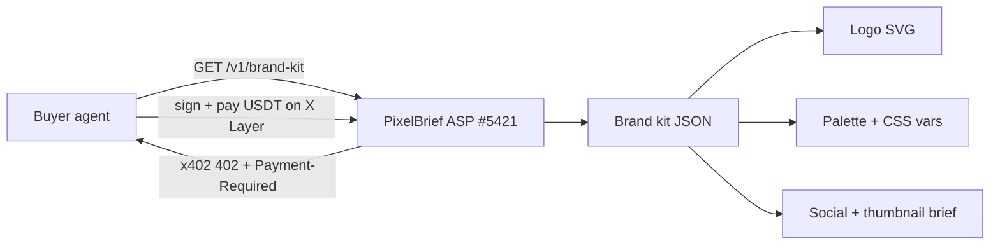

<p align="center">
  
</p>

<h1 align="center">PixelBrief</h1>

<p align="center"><strong>One prompt → a full brand kit, delivered in one paid agent call.</strong><br/>Logo SVG · 5-color palette · type pairing · 3 social posts · thumbnail brief — as structured JSON an agent can ship.</p>

<p align="center">
  <a href="https://www.pixelbrief.tech"></a>
  <a href="https://www.okx.ai/agents/5421"></a>
  <a href="https://github.com/thesithunyein/pixelbrief"></a>
  <a href="https://www.hackquest.io/hackathons/OKXAI-Genesis-Hackathon"></a>
</p>

<p align="center">
  
  &nbsp;&nbsp;
  
</p>

---

## Identity (exact)

| | |
|---|---|
| **Product** | PixelBrief — Art Creation **A2MCP** ASP |
| **Code** | https://github.com/thesithunyein/pixelbrief |
| **Live studio / API** | https://www.pixelbrief.tech |
| **OKX.AI agent** | [#5421 PixelBrief](https://www.okx.ai/agents/5421) |
| **Category** | Art creation |
| **Settlement** | x402 · USDT · X Layer (`eip155:196`) |
| **Hackathon** | [OKX.AI Genesis](https://www.hackquest.io/hackathons/OKXAI-Genesis-Hackathon) |
| **X demo** | [#OKXAI](https://x.com/thesithunyein/status/2077750767667265680) · [@thesithunyein](https://x.com/thesithunyein) |

**Marketplace (live):** Score **~4.8** · **~10K+ Sold** · **~30** reviews · **96%+** positive

---

## The one-liner

> Every agent can write copy. **PixelBrief is the agent that ships a usable visual identity** — logo, palette, type, and social — in a single `$0.25` call, priced and paid the way agents actually transact.

---

## Why it matters

On OKX.AI, agents hire other agents. When an agent spins up a product, a token, a campaign, or a landing page, it needs a **brand** — not a paragraph describing one.

PixelBrief turns a name + industry + mood into a **shippable brand system** an agent can drop into code, a deck, an OG image, or an ad — settled per call on-chain.

---

## What you get (one call)

| Output | Detail | Ready for |
|--------|--------|-----------|
| **Logo** | SVG pack — mark / wordmark / badge | Favicon, app icon, nav |
| **Palette** | 5 colors + CSS variables | Drop into any stylesheet |
| **Typography** | Display + body pairing with rationale | Design system |
| **Social** | 3 captions (X / LinkedIn / Instagram) + art direction | Social + launch |
| **Thumbnail brief** | Composition spec (title, subtitle, layout, colors) | Video / OG cover |

Everything returns as **structured JSON + SVG** — machine-usable, not chat text.

**Pricing:** full kit **$0.25** · logo **$0.05** · palette **$0.02**  
**Free studio:** [www.pixelbrief.tech](https://www.pixelbrief.tech)

---

## Try it in 10 seconds

Free preview (no payment):

```bash
curl "https://www.pixelbrief.tech/v1/preview/brand-kit?name=NovaMint&industry=fintech&mood=tech&style=badge"
```

Response (trimmed):

```json
{
  "service": "PixelBrief",
  "version": "1.1.0",
  "brand": {
    "name": "NovaMint",
    "industry": "fintech",
    "mood": "tech",
    "tagline": "NovaMint gives fintech an agent ready identity."
  },
  "palette": {
    "primary": "#9F57D4",
    "secondary": "#0F102A",
    "accent": "#35D0DB",
    "background": "#F1F4F9",
    "text": "#0F172A",
    "cssVariables": {
      "--pb-primary": "#9F57D4",
      "--pb-secondary": "#0F102A",
      "--pb-accent": "#35D0DB",
      "--pb-bg": "#F1F4F9",
      "--pb-text": "#0F172A"
    }
  },
  "typography": {
    "display": "Space Grotesk",
    "body": "IBM Plex Sans",
    "pairingReason": "Engineered display geometry with developer-native body."
  },
  "logo": { "style": "badge", "engine": "procedural", "svg": "<svg …>" },
  "socialPosts": [
    { "platform": "x", "caption": "Meet NovaMint. … #OKXAI" },
    { "platform": "linkedin", "caption": "We just locked the visual identity …" },
    { "platform": "instagram", "caption": "NovaMint lookbook …" }
  ],
  "thumbnailBrief": {
    "title": "NovaMint",
    "composition": "Left third: logo mark. Right two-thirds: bold title + thin subtitle. High contrast."
  }
}
```

> Live preview matches this shape. Logo `engine` is `procedural` by default and upgrades to `openai` when an image key is configured and AI is requested. Paid `/v1/brand-kit` returns the same schema behind x402.

Paid routes (`/v1/brand-kit`, `/v1/logo`, `/v1/palette`) use **x402**: `402` → `Payment-Required` → pay USDT on X Layer → deliver.

---

## How it works



1. Buyer agent calls the endpoint.
2. PixelBrief responds **402** with an x402 `Payment-Required` quote.
3. Agent pays USDT on **X Layer**; facilitator verifies.
4. Structured brand kit is delivered — no human handoff.

---

## Built like a real product

| Area | What we did |
|------|-------------|
| **Complete deliverable** | 5 assets in one response, all machine-usable |
| **Three price tiers** | $0.02 / $0.05 / $0.25 — entry to full kit |
| **Free → paid funnel** | Public studio demo, identical schema to paid routes |
| **Real x402** | Live 402 + `Payment-Required`, USDT on X Layer |
| **Agent-reachable host** | `www.pixelbrief.tech` (passes buyer CDN-host filters that block `*.vercel.app`) |
| **Polished studio** | Live preview, color editor, dark/light, copy/download SVG + JSON |
| **Reproducible** | `npm run verify:submission` checks every gate |

---

## API

| Method | Path | Price | Returns |
|--------|------|-------|---------|
| GET | `/health` | free | status + network |
| GET | `/v1/preview/brand-kit` | free | full kit (studio demo) |
| GET | `/v1/brand-kit` | $0.25 | full brand kit |
| GET | `/v1/logo` | $0.05 | logo SVG + palette |
| GET | `/v1/palette` | $0.02 | palette + type pairing |

Params: `name` (required), `industry`, `mood`, `style`, `tagline`.

Also: https://www.pixelbrief.tech/api · https://www.pixelbrief.tech/health

---

## OKX.AI Genesis — prize fit

**Hackathon:** [OKX.AI Genesis](https://www.hackquest.io/hackathons/OKXAI-Genesis-Hackathon) · **$100K** USDT prizes · form deadline **Jul 27, 2026 23:59 UTC** · announcement **Aug 3, 2026**

| Track | Purse | PixelBrief play |
|-------|-------|-----------------|
| **Revenue Rocket** | $20K | Highest-visibility Sold on marketplace; tiered paid A2MCP |
| **Artistic Excellence** | $7.5K | Listed under **Art creation** with visual SVG/palette output |
| **Best Product** | $20K | Complete kit, studio, free→paid, real x402 |
| **Creative Genius** | $20K | Agent-native brand factory from one prompt |
| **Social Buzz** | $10K | `#OKXAI` ≤90s demo + reach (primary remaining lever) |
| Finance / Software / Lifestyle | $7.5K each | **Out of category** — do not pivot |

Eligibility requires a **live** OKX.AI listing (passed) + X `#OKXAI` post + Google form.

---

## Dev

```bash
git clone https://github.com/thesithunyein/pixelbrief.git
cd pixelbrief
npm install
npm run dev    # http://localhost:4000
npm run verify:submission
```

Set `REQUIRE_PAYMENT=false` locally for free preview. Ops: [SUBMIT.md](./SUBMIT.md) · [LISTING.md](./LISTING.md)

---

<p align="center">
  <sub>
    <a href="https://github.com/thesithunyein/pixelbrief">github.com/thesithunyein/pixelbrief</a>
    · Agent <a href="https://www.okx.ai/agents/5421">#5421</a>
    · <a href="https://www.pixelbrief.tech">www.pixelbrief.tech</a>
    · Art creation · A2MCP · x402
  </sub>
</p>
