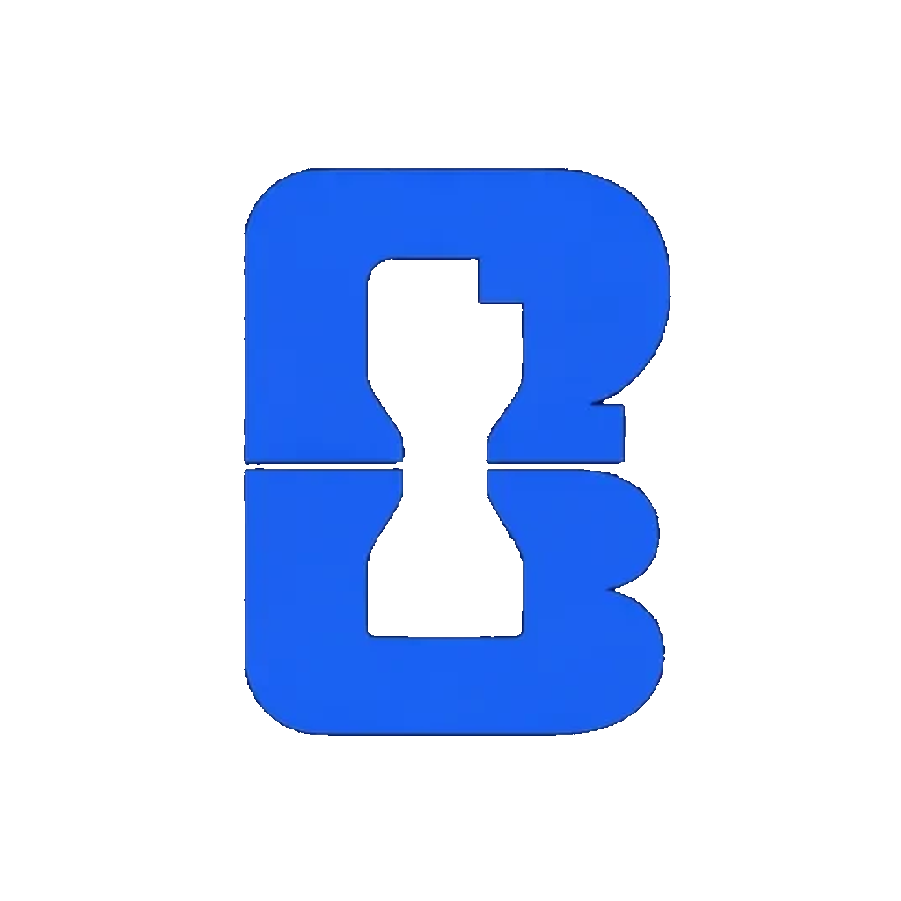
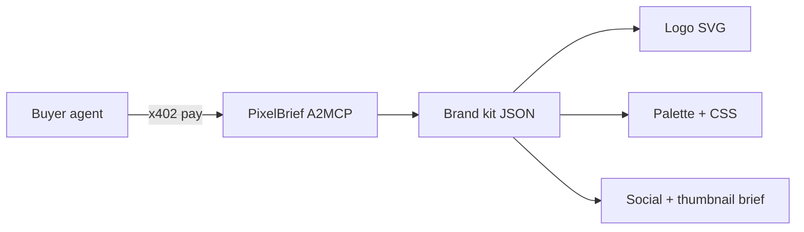

<p align="center">
  
</p>

<h1 align="center">PixelBrief</h1>

<p align="center"><strong>One prompt → full brand kit.</strong><br/>Logo SVG · palette · type · social posts · thumbnail brief — one paid agent call.</p>

<p align="center">
  <a href="https://pixelbrief.tech"></a>
  <a href="https://www.okx.ai/agents/5421"></a>
  <a href="https://www.hackquest.io/hackathons/OKXAI-Genesis-Hackathon"></a>
</p>

<p align="center">
  
  &nbsp;&nbsp;
  
</p>

<p align="center">
  <b>Art creation</b> · <b>A2MCP</b> · <b>x402</b> on X Layer · <b>Agent #5421</b>
</p>

---

## Demo hook (first 3 seconds)

> **Logo + studio:** “PixelBrief — one prompt, full brand kit. Agents pay $0.25 on OKX.”

---

## Problem → solution

Agents can generate copy. Few can **deliver a shippable brand system in one paid call**.

PixelBrief is an **Art Creation A2MCP** on [OKX.AI](https://www.okx.ai). Send a name, industry, and mood — get:

| Output | Detail |
|--------|--------|
| Logo | SVG pack (mark / wordmark / badge) |
| Palette | 5 colors + CSS variables |
| Typography | Display + body pairing |
| Social | 3 captions with art direction |
| Thumbnail | Composition brief for video / OG |

**Pricing:** brand kit **$0.25** · logo **$0.05** · palette **$0.02**  
**Studio (free):** [pixelbrief.tech](https://pixelbrief.tech)

---

## How it works



1. Agent calls `GET /v1/brand-kit` on X Layer.
2. x402 settles USDT per call.
3. Structured JSON + SVG returns — ready for code, decks, or ads.

---

## Live

| | |
|---|---|
| Studio | https://pixelbrief.tech |
| Health | https://pixelbrief.tech/health |
| OKX listing | https://www.okx.ai/agents/5421 |
| Agent ID | **#5421** |

```bash
npm run verify:submission
```

---

## API

| Method | Path | Price |
|--------|------|-------|
| GET | `/health` | free |
| GET | `/v1/preview/brand-kit` | free (studio) |
| GET | `/v1/brand-kit` | $0.25 |
| GET | `/v1/logo` | $0.05 |
| GET | `/v1/palette` | $0.02 |

Params: `name` (required), `industry`, `mood`, `style`, `tagline`.

---

## Hackathon tracks

Built for **OKX.AI Genesis** — **Art creation** category, **A2MCP** pay-per-call, real x402 settlement on X Layer.

Targets: **Artistic Excellence** · **Creative Genius** · **Best Product** · **Revenue Rocket** · **Social Buzz**

Submission: live ASP on OKX.AI · `#OKXAI` demo ≤90s · [Google form](https://forms.gle/mddEUagmDbyV37ws8)

---

## Dev

```bash
npm install
npm run dev    # http://localhost:4000
```

Set `REQUIRE_PAYMENT=false` locally. Full deploy + listing steps: [SUBMIT.md](./SUBMIT.md)

---

<p align="center">
  <sub>OKX.AI Genesis · Art creation · A2MCP · Agent #5421</sub>
</p>
