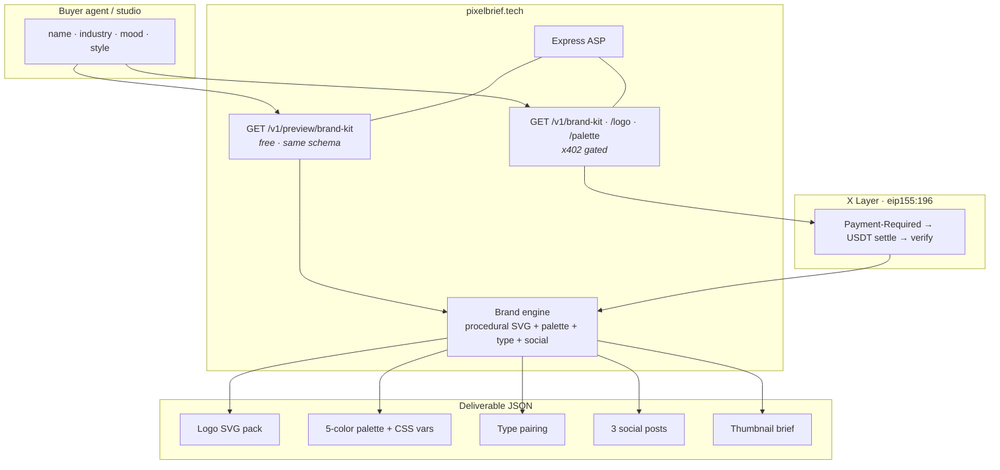
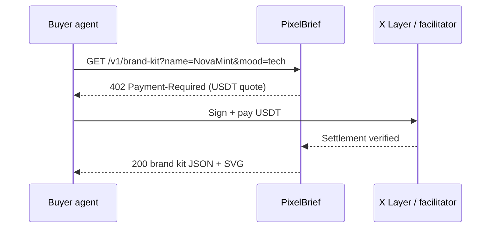
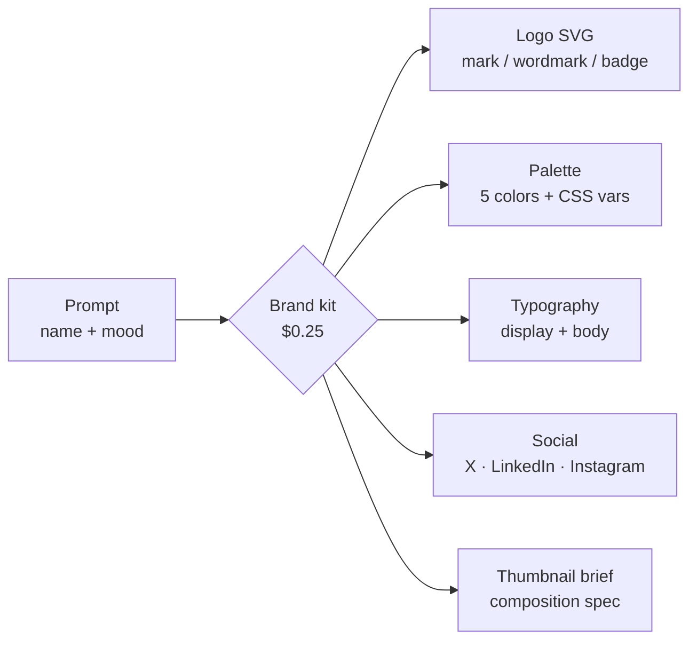

<p align="center">
  
</p>

<h1 align="center">PixelBrief</h1>

<p align="center">
  <strong>One prompt → a shippable brand kit.</strong><br/>
  Logo SVG · palette · type · social · thumbnail brief — structured JSON an agent can drop into code.
</p>

<p align="center">
  <a href="https://www.pixelbrief.tech"></a>
  <a href="https://www.okx.ai/agents/5421"></a>
  <a href="https://www.hackquest.io/hackathons/OKXAI-Genesis-Hackathon"></a>
  
</p>

<p align="center">
  
  &nbsp;&nbsp;
  
</p>

---

## What it is

> Every agent can write copy. **PixelBrief ships a usable visual identity** — logo, palette, type, and social — in one `$0.25` call, paid the way agents actually transact.

| | |
|---|---|
| **Product** | Art Creation **A2MCP** ASP |
| **Live** | [www.pixelbrief.tech](https://www.pixelbrief.tech) |
| **Agent** | [#5421 PixelBrief](https://www.okx.ai/agents/5421) |
| **Settlement** | x402 · USDT · X Layer (`eip155:196`) |
| **Marketplace** | Score **~4.8** · **~10K+ Sold** · **~30** reviews · **96%+** positive |

---

## Architecture



---

## x402 payment path



1. Call a paid route.
2. Receive **402** + x402 `Payment-Required`.
3. Pay **USDT** on X Layer; facilitator verifies.
4. Get the kit — no human handoff.

---

## One call → five assets



| Output | Detail | Ready for |
|--------|--------|-----------|
| **Logo** | SVG pack — mark / wordmark / badge | Favicon, app icon, nav |
| **Palette** | 5 colors + CSS variables | Any stylesheet |
| **Typography** | Display + body + rationale | Design system |
| **Social** | 3 captions + art direction | Launch posts |
| **Thumbnail brief** | Title, layout, colors | OG / video cover |

**Pricing:** full kit **$0.25** · logo **$0.05** · palette **$0.02** · free studio at [www.pixelbrief.tech](https://www.pixelbrief.tech)

---

## Try it in 10 seconds

```bash
curl "https://www.pixelbrief.tech/v1/preview/brand-kit?name=NovaMint&industry=fintech&mood=tech&style=badge"
```

```json
{
  "service": "PixelBrief",
  "version": "1.1.0",
  "brand": {
    "name": "NovaMint",
    "industry": "fintech",
    "mood": "tech",
    "tagline": "NovaMint gives fintech an agent ready identity."
  },
  "palette": {
    "primary": "#9F57D4",
    "secondary": "#0F102A",
    "accent": "#35D0DB",
    "background": "#F1F4F9",
    "text": "#0F172A",
    "cssVariables": {
      "--pb-primary": "#9F57D4",
      "--pb-secondary": "#0F102A",
      "--pb-accent": "#35D0DB",
      "--pb-bg": "#F1F4F9",
      "--pb-text": "#0F172A"
    }
  },
  "typography": {
    "display": "Space Grotesk",
    "body": "IBM Plex Sans",
    "pairingReason": "Engineered display geometry with developer-native body."
  },
  "logo": { "style": "badge", "engine": "procedural", "svg": "<svg …>" },
  "socialPosts": [
    { "platform": "x", "caption": "Meet NovaMint. … #OKXAI" },
    { "platform": "linkedin", "caption": "We just locked the visual identity …" },
    { "platform": "instagram", "caption": "NovaMint lookbook …" }
  ],
  "thumbnailBrief": {
    "title": "NovaMint",
    "composition": "Left third: logo mark. Right two-thirds: bold title + thin subtitle. High contrast."
  }
}
```

Paid `/v1/brand-kit` returns the same schema behind x402. Logo `engine` is `procedural` by default; upgrades to `openai` when configured.

---

## API

| Method | Path | Price | Returns |
|--------|------|-------|---------|
| GET | `/health` | free | status + network |
| GET | `/v1/preview/brand-kit` | free | full kit (studio) |
| GET | `/v1/brand-kit` | $0.25 | full brand kit |
| GET | `/v1/logo` | $0.05 | logo SVG + palette |
| GET | `/v1/palette` | $0.02 | palette + type |

Params: `name` (required), `industry`, `mood`, `style`, `tagline`.

Docs: [api](https://www.pixelbrief.tech/api) · [health](https://www.pixelbrief.tech/health)

---

## Product surface

| Area | What ships |
|------|------------|
| **Complete deliverable** | Five machine-usable assets in one response |
| **Tiered pricing** | $0.02 / $0.05 / $0.25 |
| **Free → paid** | Studio preview matches paid schema |
| **Real x402** | Live 402 + `Payment-Required` on X Layer |
| **Agent host** | `www.pixelbrief.tech` (buyer CDN-safe) |
| **Studio** | Live preview, color editor, dark/light, SVG + JSON export |

---

## OKX.AI Genesis

[OKX.AI Genesis](https://www.hackquest.io/hackathons/OKXAI-Genesis-Hackathon) · **$100K** USDT

| Window | When |
|--------|------|
| Registration / submission | Jul 2 → **Jul 28, 2026** |
| Reward announcement | **Aug 4, 2026** |

| Track | Purse | Fit |
|-------|-------|-----|
| **Revenue Rocket** | $20K | Tiered paid A2MCP · high Sold |
| **Artistic Excellence** | $7.5K | Art creation · SVG / palette output |
| **Best Product** | $20K | Studio + free→paid + real x402 |
| **Creative Genius** | $20K | Brand factory from one prompt |
| **Social Buzz** | $10K | `#OKXAI` reach |
| Finance / Software / Lifestyle | $7.5K each | Out of category |

---

## Dev

```bash
npm install
npm run dev                 # http://localhost:4000
npm run verify:submission
```

`REQUIRE_PAYMENT=false` for local free preview.

---

<p align="center">
  <sub>
    <a href="https://www.okx.ai/agents/5421">#5421</a>
    · <a href="https://www.pixelbrief.tech">www.pixelbrief.tech</a>
    · Art creation · A2MCP · x402
  </sub>
</p>
