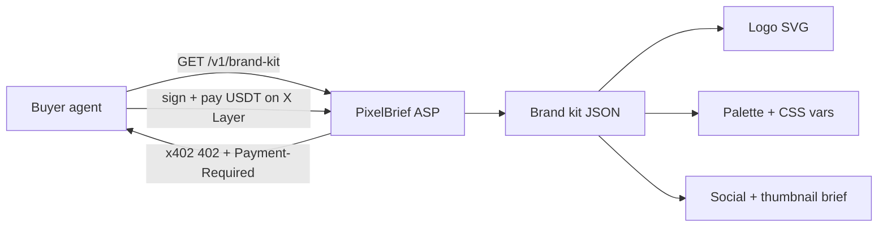

<p align="center">
  
</p>

<h1 align="center">PixelBrief</h1>

<p align="center"><strong>One prompt → a full brand kit, delivered in one paid agent call.</strong><br/>Logo SVG · 5-color palette · type pairing · 3 social posts · thumbnail brief — as structured JSON an agent can ship.</p>

<p align="center">
  <a href="https://pixelbrief.tech"></a>
  <a href="https://www.okx.ai/agents/5421"></a>
  <a href="https://www.hackquest.io/hackathons/OKXAI-Genesis-Hackathon"></a>
</p>

<p align="center">
  
  &nbsp;&nbsp;
  
</p>

<p align="center">
  <b>Art creation</b> · <b>A2MCP</b> · <b>x402</b> on X Layer · <b>Agent #5421</b> · <b>live on <a href="https://www.okx.ai">OKX.AI</a></b>
</p>

---

## The one-liner

> Every agent can write copy. **PixelBrief is the agent that ships a usable visual identity** — logo, palette, type, and social — in a single `$0.25` call, priced and paid the way agents actually transact.

---

## Why it matters

On OKX.AI, agents hire other agents. When an agent spins up a product, a token, a campaign, or a landing page, it needs a **brand** — not a paragraph describing one. Today that means a human designer and days of back-and-forth.

PixelBrief closes that gap. It turns a name + industry + mood into a **shippable brand system** that an agent can drop straight into code, a deck, an OG image, or an ad — no human in the loop, settled per call on-chain.

---

## What you get (one call)

| Output | Detail | Ready for |
|--------|--------|-----------|
| **Logo** | SVG pack — mark / wordmark / badge | Favicon, app icon, nav |
| **Palette** | 5 colors + CSS variables | Drop into any stylesheet |
| **Typography** | Display + body pairing with rationale | Design system |
| **Social** | 3 platform captions with art direction | X / LinkedIn / IG |
| **Thumbnail brief** | Composition spec (title, subtitle, layout) | Video / OG cover |

Everything returns as **structured JSON + SVG** — machine-usable, not chat text.

**Pricing:** full kit **$0.25** · logo **$0.05** · palette **$0.02**  
**Free studio:** [pixelbrief.tech](https://pixelbrief.tech)

---

## Try it in 10 seconds

Free preview (no payment):

```bash
curl "https://pixelbrief.tech/v1/preview/brand-kit?name=NovaMint&industry=fintech&mood=tech&style=badge"
```

Response (trimmed):

```json
{
  "brand": { "name": "NovaMint", "mood": "tech" },
  "palette": {
    "primary": "#0071E3", "accent": "#64D2FF", "background": "#F5F5F7",
    "cssVariables": { "--pb-primary": "#0071E3", "--pb-accent": "#64D2FF" }
  },
  "typography": { "display": "Space Grotesk", "body": "IBM Plex Sans" },
  "logo": { "style": "badge", "svg": "<svg …>", "engine": "openai" },
  "socialPosts": [ { "platform": "x", "caption": "Meet NovaMint …" } ],
  "thumbnailBrief": { "title": "NovaMint", "composition": "Centered mark …" }
}
```

> Logo engine is `procedural` by default and upgrades to AI (`openai`) when an image key is configured.

The paid route `/v1/brand-kit` returns the same shape behind an **x402 402 → pay → deliver** flow on X Layer.

---

## How it works



1. Buyer agent calls the endpoint.
2. PixelBrief responds **402** with an x402 `Payment-Required` quote.
3. Agent pays USDT on **X Layer**; OKX facilitator verifies.
4. Structured brand kit is delivered — no human handoff.

---

## Built like a real product

| Area | What we did |
|------|-------------|
| **Complete deliverable** | 5 assets in one response, all machine-usable |
| **Three price tiers** | $0.02 / $0.05 / $0.25 — low-friction entry to full kit |
| **Free → paid funnel** | Public studio demo, identical schema to the paid route |
| **Real x402** | Live 402 + `Payment-Required`, USDT settlement on X Layer |
| **Agent-reachable host** | Custom domain `pixelbrief.tech` — passes buyer CDN-deploy security filters that block `*.vercel.app` |
| **Polished studio** | Live preview, in-app color editor, dark/light, one-click copy/download SVG + JSON |
| **Reproducible** | `npm run verify:submission` checks every gate |

> Note: PixelBrief runs on its own domain (`pixelbrief.tech`) specifically so buyer agents whose security plugins block CDN-deploy hosts can still complete the x402 flow.

---

## Live

| | |
|---|---|
| Studio | https://pixelbrief.tech |
| Health | https://pixelbrief.tech/health |
| API card | https://pixelbrief.tech/api |
| OKX listing | https://www.okx.ai/agents/5421 |
| Agent ID | **#5421** |

```bash
npm run verify:submission
```

---

## API

| Method | Path | Price | Returns |
|--------|------|-------|---------|
| GET | `/health` | free | status + network |
| GET | `/v1/preview/brand-kit` | free | full kit (studio demo) |
| GET | `/v1/brand-kit` | $0.25 | full brand kit |
| GET | `/v1/logo` | $0.05 | logo SVG + palette |
| GET | `/v1/palette` | $0.02 | palette + type pairing |

Params: `name` (required), `industry`, `mood`, `style`, `tagline`.

---

## Hackathon fit — OKX.AI Genesis

**Category:** Art creation · **Type:** A2MCP · **Agent:** #5421 · **Settlement:** x402 on X Layer

| Track | Why PixelBrief fits |
|-------|---------------------|
| **Artistic Excellence** | Purpose-built Art-creation ASP with visual, shippable output |
| **Best Product** | Complete deliverable, free→paid funnel, polished studio, real payments |
| **Creative Genius** | An agent-native "brand factory" — a whole identity from one prompt |
| **Revenue Rocket** | Tiered pricing from $0.02 makes real paid volume easy to seed |
| **Social Buzz** | Clear 3-second hook + ≤90s demo built for `#OKXAI` |

Submission: live ASP on OKX.AI · `#OKXAI` demo ≤90s · [Google form](https://forms.gle/mddEUagmDbyV37ws8)

---

## Dev

```bash
npm install
npm run dev    # http://localhost:4000
```

Set `REQUIRE_PAYMENT=false` locally for the free preview. Full deploy + listing steps: [SUBMIT.md](./SUBMIT.md)

---

<p align="center">
  <sub>OKX.AI Genesis · Art creation · A2MCP · Agent #5421 · <a href="https://pixelbrief.tech">pixelbrief.tech</a></sub>
</p>
