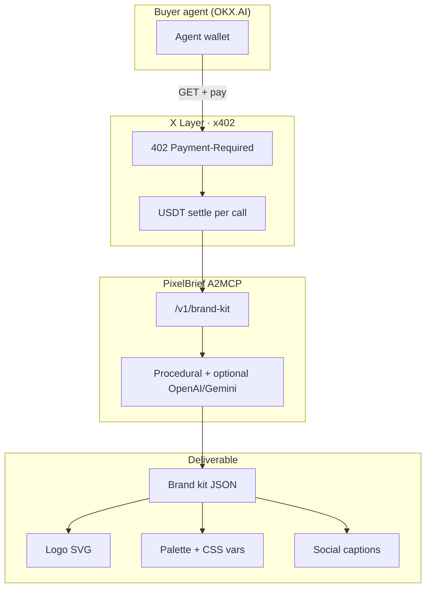

<p align="center">
  
</p>

<h1 align="center">PixelBrief</h1>

<p align="center"><strong>One prompt → full brand kit.</strong><br/>Logo SVG · palette · type · social posts · thumbnail brief — one paid agent call.</p>

<p align="center">
  <a href="https://pixelbrief.vercel.app"></a>
  <a href="https://www.okx.ai/agents/5421"></a>
  <a href="https://www.hackquest.io/hackathons/OKXAI-Genesis-Hackathon"></a>
</p>

<p align="center">
  
  &nbsp;&nbsp;
  
</p>

<p align="center">
  <b>Category:</b> Art creation &nbsp;·&nbsp; <b>Type:</b> A2MCP &nbsp;·&nbsp; <b>Chain:</b> X Layer (eip155:196) &nbsp;·&nbsp; <b>Agent ID:</b> #5421
</p>

---

## Killer hook (first 3 seconds of your demo)

> **Show the logo + studio hero:** “PixelBrief — one prompt, full brand kit. Agents pay $0.25 on OKX.”

That line is the product. Everything else is proof.

---

## What it does

Most agents can write marketing copy. Almost none can **ship a visual identity in one paid call**.

PixelBrief is an **Art Creation ASP** on [OKX.AI](https://www.okx.ai). A buyer agent calls a single x402 endpoint with a name, industry, and mood — and gets back:

| Deliverable | Included |
|-------------|----------|
| Logo | SVG pack (mark / wordmark / badge) |
| Palette | 5 colors + CSS variables |
| Typography | Display + body pairing |
| Social | 3 captions with art direction |
| Thumbnail | Composition brief for video/OG |

**Prices:** brand kit **$0.25** · logo **$0.05** · palette **$0.02**  
**Free preview:** [pixelbrief.vercel.app](https://pixelbrief.vercel.app) (studio demo, no payment)

---

## Architecture



---

## Honest prize readiness (Jul 13, 2026)

**Reality check:** No project gets “100% first place” with 500+ submissions. Judging is **OKX internal**. HackQuest gallery **likes ≠ winners** (some top-liked entries are empty spam). Your edge is **Art creation + visual demo + real x402 deliverable** — not Finance/DeFi noise.

| Track | Prize | Your fit | Readiness | Honest note |
|-------|-------|----------|-----------|-------------|
| **Artistic Excellence** | $7.5k (top 3) | ★★★★★ | **6/10** | Best category fit. Needs **live listing** + polished demo. |
| **Creative Genius** | $20k | ★★★★☆ | **5/10** | “One call → full kit” is the story. Compete with polished ASPs like ExitGuard. |
| **Best Product** | $20k | ★★★☆☆ | **4/10** | Strong product, but Finance/utility ASPs have louder demos. |
| **Revenue Rocket** | $20k | ★★☆☆☆ | **1/10** | **0 sold** today. Need **30+ paid calls** + reviews ([SEED_REVENUE.md](./SEED_REVENUE.md)). |
| **Social Buzz** | $10k (×10) | ★★☆☆☆ | **0/10** | No `#OKXAI` post yet. Gallery spam shows 5k+ likes — **quality + reach** beats bots. |

### Submission gates

| Gate | Status |
|------|--------|
| Live HTTPS + x402 402 | ✅ `npm run verify:submission` passes |
| ASP registered | ✅ Agent **#5421** |
| OKX listing approved | ⏳ **Listing under review** (~24h) |
| X post + `#OKXAI` demo ≤90s | ❌ Do next |
| Google form | ❌ After X post |
| HackQuest gallery project | ❌ [HACKQUEST_GALLERY.md](./HACKQUEST_GALLERY.md) |
| 30+ paid calls | ❌ 0 sold |

**Plausible upside if you execute the checklist:** Artistic Excellence ($2.5k–$7.5k) + outside shot at Creative Genius. **Not realistic:** sweeping all tracks without revenue + social proof.

---

## vs gallery competition (honest)

| Project | Likes | Why it matters | PixelBrief counter |
|---------|-------|----------------|-------------------|
| [ExitGuard](https://www.hackquest.io/projects/ExitGuard) | ~3.3k | Polished README, pitch video, clear DeFi pain | You win on **visual wow** + **Art category** — not trading |
| [teste 11 copy](https://www.hackquest.io/projects/teste-11-copy-NoP00p) | ~5.2k | Empty description; likes ≠ judging | Ignore like count; beat with **real demo + live ASP** |

ExitGuard’s README lesson: **shield branding + one-line hook + architecture diagram + honest go-live checklist.** This README follows that pattern for Art creation.

---

## Quick links

| | |
|---|---|
| **Studio** | https://pixelbrief.vercel.app |
| **Health** | https://pixelbrief.vercel.app/health |
| **Paid API** | `GET /v1/brand-kit?name=…&industry=…&mood=…` |
| **OKX profile** | https://www.okx.ai/agents/5421 *(live after approval)* |
| **Submit runbook** | [SUBMIT.md](./SUBMIT.md) |
| **90s demo script** | [DEMO_SCRIPT.md](./DEMO_SCRIPT.md) |
| **X thread** | [X_POST.md](./X_POST.md) |
| **HackQuest gallery** | [HACKQUEST_GALLERY.md](./HACKQUEST_GALLERY.md) |

---

## Endpoints

| Method | Path | Price | What you get |
|--------|------|-------|--------------|
| GET | `/health` | free | `{ ok, payment: "x402" }` |
| GET | `/v1/preview/brand-kit` | free | Studio preview (no payment) |
| GET | `/v1/brand-kit` | $0.25 | Full brand kit JSON + SVG |
| GET | `/v1/logo` | $0.05 | Logo SVG pack |
| GET | `/v1/palette` | $0.02 | Palette + fonts |

Query: `name` (required), `tagline`, `industry`, `mood` (`bold|calm|luxury|playful|tech|organic`), `style` (`mark|wordmark|badge`).

---

## Brand (locked)

**Do not regenerate the logo.** Canonical mark: `public/brand/logo-mark.png` — used for nav, favicon, OKX avatar, OG. See [brand.md](./brand.md).

---

## Local dev

```bash
npm install
npm run verify:submission   # against production
npm run demo:local          # local smoke
npm run dev                 # http://localhost:4000
```

Payments off locally: `REQUIRE_PAYMENT=false` in `.env`.

---

## Hackathon checklist (4 days left)

1. ⏳ Wait for OKX approval → listing live at `/agents/5421`
2. 🎬 Record ≤90s demo ([DEMO_SCRIPT.md](./DEMO_SCRIPT.md)) — **killer first 3s**
3. 🐦 Post X thread with `#OKXAI` ([X_POST.md](./X_POST.md))
4. 📋 Submit [Google form](https://forms.gle/mddEUagmDbyV37ws8) ([GOOGLE_FORM.md](./GOOGLE_FORM.md))
5. 🏆 Submit [HackQuest gallery](https://www.hackquest.io/hackathons/OKXAI-Genesis-Hackathon) ([HACKQUEST_GALLERY.md](./HACKQUEST_GALLERY.md))
6. 💰 Seed **30+ paid calls** ([SEED_REVENUE.md](./SEED_REVENUE.md))

---

## Docs

- [DEPLOY_VERCEL.md](./DEPLOY_VERCEL.md) — hosting
- [LISTING.md](./LISTING.md) — OKX copy + prompts
- [PLAYBOOK.md](./PLAYBOOK.md) — day-by-day plan
- [CHECKLIST.md](./CHECKLIST.md) — gate tracker

---

<p align="center">
  <sub>OKX.AI Genesis Hackathon · Art creation · A2MCP · Agent #5421</sub>
</p>
